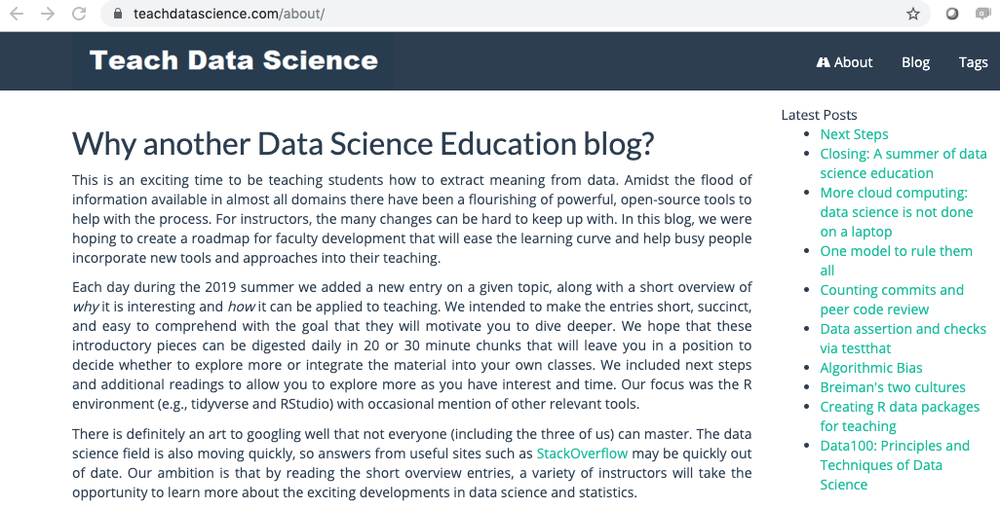
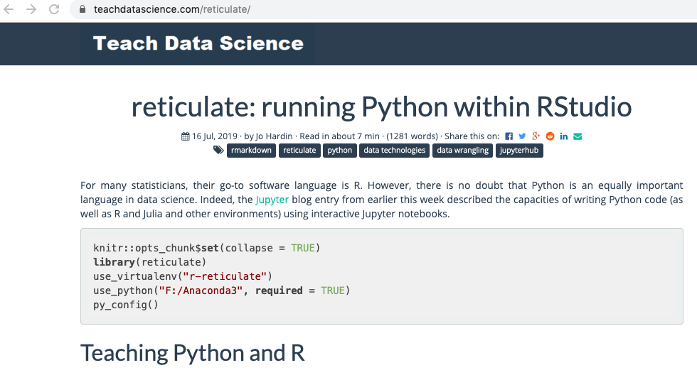
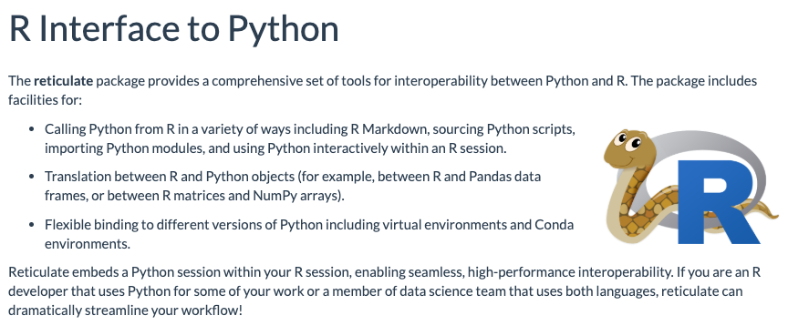
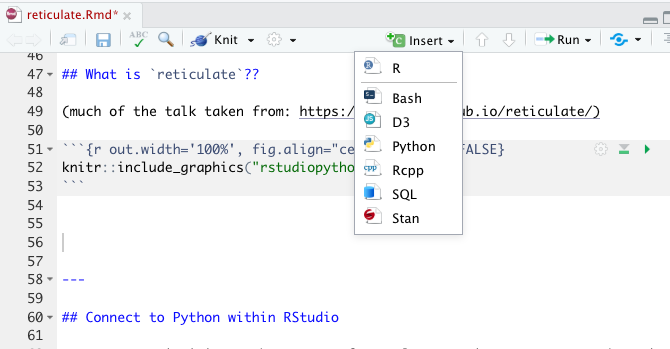
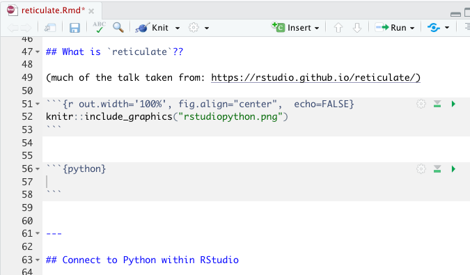
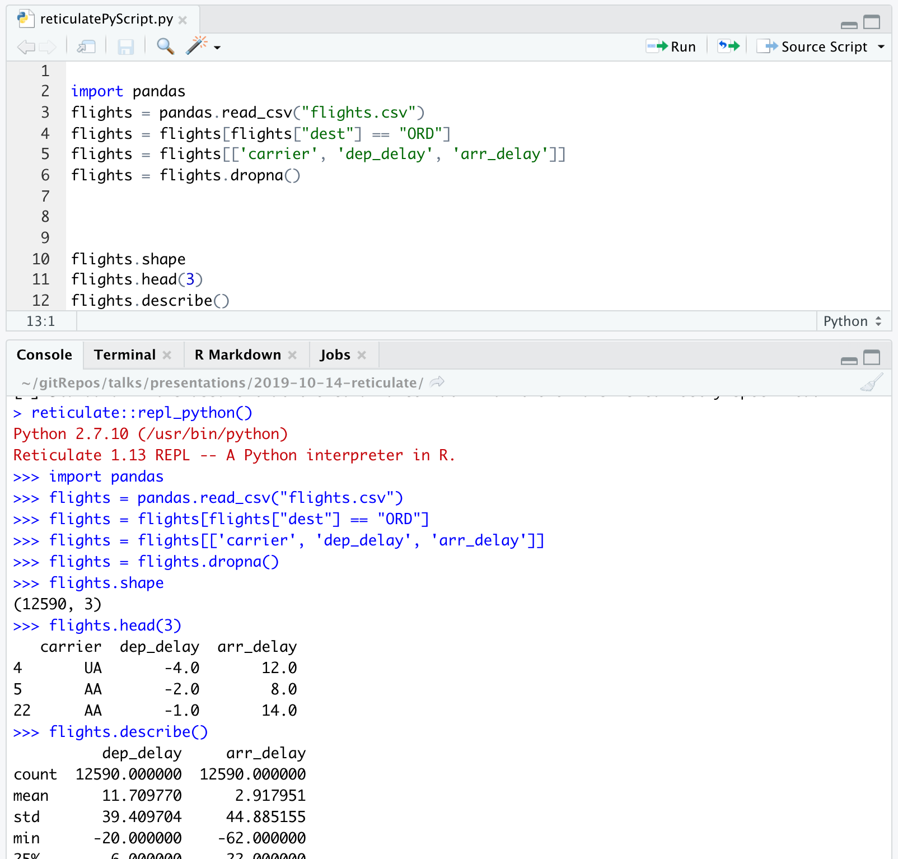
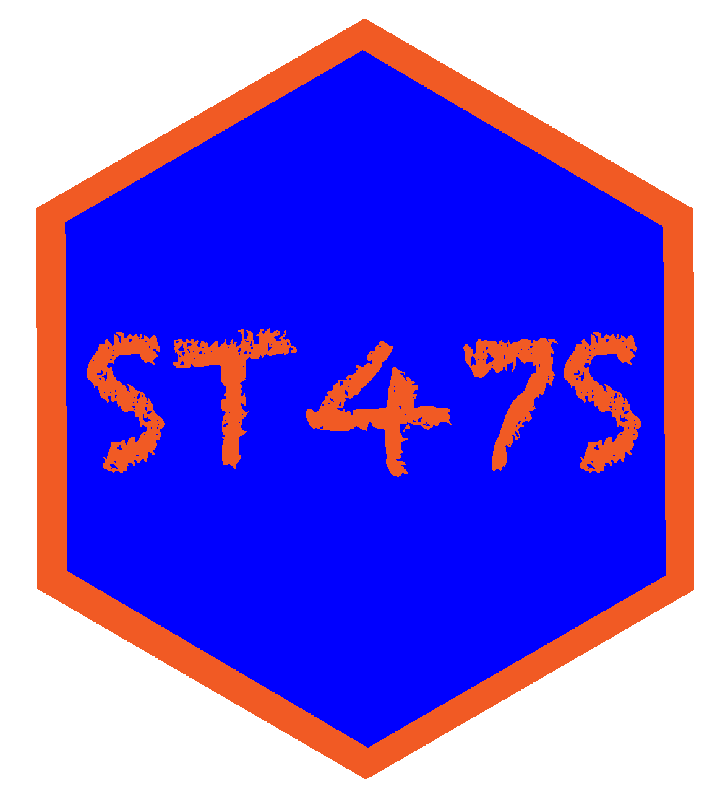

```{r echo=FALSE, message = FALSE, warning = FALSE}
library(tidyverse)
library(skimr)
library(knitr)
opts_chunk$set(
  message=FALSE,
  warning=FALSE,
  size='small',
  cache=FALSE,
  tidy=FALSE
  )
options(digits=3)

```

## Just say Yes! -- https://teachdatascience.com/

```{r out.width='100%', fig.align="center",  echo=FALSE}

```


---

## Teach Data Science: `reticulate`

```{r out.width='100%', fig.align="center",  echo=FALSE}

```

---

## What is `reticulate`??

(much of the talk taken from: https://rstudio.github.io/reticulate/)

```{r out.width='100%', fig.align="center",  echo=FALSE}

```

---

## Connect to Python within RStudio

For many statisticians, the go-to software language is R.  However, there is no doubt that Python is a very important language in data science.  Why not do both??

```{r setup, message=FALSE, warning=FALSE}
library(reticulate)
use_virtualenv("r-reticulate")
import("statsmodels")
```

---

## I can run Python inside R??
```{r out.width='65%', fig.align="left",  echo=FALSE}

```
```{r out.width='65%', fig.align="right",  echo=FALSE}

```


---

## Python in R

* `pandas` for data wrangling.  
* In R, the chunk is specified to be a Python chunk (RStudio is now running Python). 


````
```{python}`r ''`
import pandas
flights = pandas.read_csv("flights.csv")
flights = flights[flights["dest"] == "ORD"]
flights = flights[['carrier', 'dep_delay', 'arr_delay']]
flights = flights.dropna()
```
````


A view of the Python chunk which is actually run:

```{python}
import pandas
flights = pandas.read_csv("flights.csv")
flights = flights[flights["dest"] == "ORD"]
flights = flights[['carrier', 'dep_delay', 'arr_delay']]
flights = flights.dropna()
```

---

## Learn about the dataset

.left-code[
````
```{python}`r ''`
flights.shape
flights.head(3)
flights.describe()
```
````
]

.right-plot[
```{python}
flights.shape
flights.head(3)
flights.describe()
```
]

---

## Computations 


````
```{python}`r ''`
flights = pandas.read_csv("flights.csv")
flights = flights[['carrier', 'dep_delay', 'arr_delay']]
flights.groupby("carrier").mean()
```
````

```{python}
flights = pandas.read_csv("flights.csv")
flights = flights[['carrier', 'dep_delay', 'arr_delay']]
flights.groupby("carrier").mean()
```

---

## From Python chunk to R chunk

* <mark>`py$x` </mark> accesses an `x` variable created within Python from R
* <mark> `r.x` </mark> accesses an `x` variable created within R from Python

````
```{r}`r ''`
library(ggplot2)
ggplot(py$flights, aes(x=carrier, y = arr_delay)) + 
  geom_point() + geom_jitter()
```
````
---

## From Python chunk to R chunk

* `py$x` accesses an `x` variable created within Python from R
* `r.x` accesses an `x` variable created within R from Python

.left-code[
```{r eval=FALSE}
library(ggplot2)
ggplot(py$flights, 
       aes(x=carrier, 
           y=arr_delay)) + 
  geom_point() + 
  geom_jitter()
```
]

.right-plot[
```{r echo=FALSE, fig.height=5}
library(ggplot2)
ggplot(py$flights, 
       aes(x=carrier, y = arr_delay)) + 
  geom_point() + 
  geom_jitter()
```
]

---

## From R chunk to Python chunk

```{r}
data(diamonds)
head(diamonds)
```

---

##  A Python chunk

```{python}
print(r.diamonds.describe())
```
---

## A Python chunk

```{python out.width = "20px"}
import statsmodels.formula.api as smf
model = smf.ols('price ~ carat', data = r.diamonds).fit()
print(model.summary())
```

---

## Bells and whistles

.left-column[
* autocomplete

* Python script
]

.right-column[
```{r out.width='120%', echo=FALSE}

```

]


---

## Importing Python modules

`import()` will import any Python module and call it from R.  [The `os` module provides functionality for navigating the operating system.]

```{r}
os <- import("os")
os$listdir(".")
```

---

## Full disclosure

* Python versions (@#$%#$%@#$  ????)

* module versions (@%#$%@#$%#$ ????)

---

## Learn more

- [RStudio R Interface to Python](https://rstudio.github.io/reticulate/)

https://rstudio.github.io/reticulate/  

- [RStudio blog on Reticulated Python](https://blog.rstudio.com/2018/10/09/rstudio-1-2-preview-reticulated-python/)  

https://blog.rstudio.com/2018/10/09/rstudio-1-2-preview-reticulated-python


---

## Thank you!

* `jo.hardin@pomona.edu`

* `@jo_hardin47`

* https://github.com/hardin47

* http://research.pomona.edu/johardin/

.pull-right[
```{r out.width='85%', echo=FALSE}

```

]


